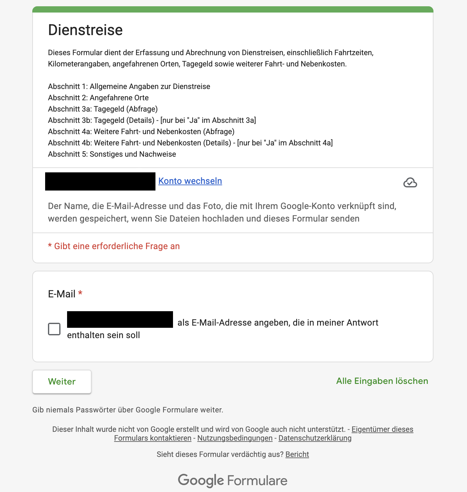
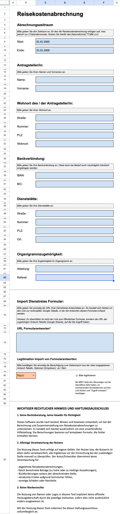

# Handbuch

Anleitung zum Ausfüllen und Abrechnen einer Dienstreise. 
Technische Details zu den einzelnen Formeln: siehe [Formeln.md](Formeln.md).

## Der Prozess auf einen Blick

Von der Formulareingabe bis zur unterschriftsreifen Abrechnung sind nur drei
eigene Handgriffe nötig — alles dazwischen übernimmt die Tabelle automatisch:

1. **Formular ausfüllen** (pro Reise)
2. **Setup: Zeitraum setzen** (pro Abrechnung)
3. **Ausdrucken und unterschreiben**

**Was die Tabelle automatisch übernimmt, statt es von Hand zu tun:**

| Ohne dieses Tool | Mit dieser Tabelle |
|---|---|
| Kilometer manuell berechnen und plausibilisieren | automatisch berechnet |
| Tagegeld-Staffel per Hand anhand der Abwesenheitszeiten ermitteln | automatisch anhand der Zeitschwellen berechnet |
| Amtliches Formular S1/S2 von Hand ausfüllen | automatisch aus dem Abrechnungszeitraum befüllt |
| Fahrtenbuch manuell führen | automatisch als Druck-Fahrtenbuch erstellt |
| Route in Google Maps von Hand eintippen | fertiger Routenlink je Reise |
| Vermerke/Besonderheiten separat dokumentieren | automatisch aus „Sonstige Informationen" gesammelt |
| Reisenummerierung von Hand pflegen | automatisch fortlaufend je Kalenderjahr vergeben |

## Ablauf

1. **Google-Formular:Dienstreise** – jeweils eine Dienstreise pro Formulareingabe ausfüllen.
2. **Blatt:Setup** – einmalig Stammdaten und Freigabe erteilen, Zur Abrechnung Abrechnungszeitraum eingeben (max. 2 Monate), blaue Platzhalter nutzen.
3. **Automatisierung** – Dienstreisen erscheinen automatisch in den Blättern: S1, Fahrtenbuch-Druck, Vermerke, GoogleMapsExport sowie in den geschützen Blättern IMPORTDATA und BERECHNUNG.
4. **Ausdruck** – S1 & S2, Fahrtenbuch-Druck sowie Orte und ggf. Vermerke drucken. 

## Die Blätter im Überblick

Nur Formular und Setup werden von Hand gepflegt. Alle anderen Blätter sind reine Formelergebnisse — dort wird nichts am PC eingetragen. Diese funktionieren automatisch.

**Automatisch berechnet und ausgegeben werden:**
- Tagegeld-Staffel (anteilig ≤8h, >8h, ≥14h, 24h) je nach Abwesenheitsdauer
- Dienstlich gefahrene Kilometer, bereinigt um private Umwege
- Reiseweg als Text mit allen angefahrenen Orten
- Fahrt- und Nebenkosten: ÖPNV, Übernachtung, Mitnahme von Personen, sonstige Nebenkosten
- Google-Maps-Routenlink zur Reise

Ausgegeben in S1/S2, Druck-Fahrtenbuch, Vermerke und GoogleMapsExport.

| Blatt | Wozu es da ist | Was hier zu tun ist |
|---|---|---|
| Setup | Zentrale Konfiguration: Verknüpfung zur Formularantworten-Datei, Freigabe-Schalter, Stammdaten der Person, Abrechnungszeitraum | Einmalig einrichten (Personendaten, URL, Freigabe), **Wichtig:** pro Abrechnung den exakten Zeitraum setzen |
| IMPORTDATA | Rohübernahme der Formularantworten aus der externen Google-Form-Datei, unverändert — Zwischenspeicher, damit BERECHNUNG nicht direkt auf die fremde Datei zugreift | Nichts — automatischer Rohimport der Formularantworten |
| BERECHNUNG | Kernblatt: bereitet jede Reise auf (Zeiten, Kilometer, Tagegeld-Staffel), eine Zeile je Reise — Grundlage für alle Ausgabeblätter | Nichts - automatische Berechnung der importierten Werte aus IMPORTDATA |
| S1 / S2 | Amtliches Formular zur Erstattung, wird unterschrieben eingereicht | Nichts — ausdrucken und unterschreiben |
| Vermerke | Sammelt besondere Anmerkungen zu Reisen (Feld „Sonstige Informationen") als Nachweis/für Rückfragen | Nichts — bei Bedarf ausdrucken. Händisch nach Ausdruck ggf. Detailbeschreibung |
| Druck-Fahrtenbuch | Vollständige, druckfähige Auflistung aller Reisen des Zeitraums für die Fahrtenbuch-Nachweispflicht | Nichts - ausdrucken und händisch in der Spalte Unterschrift unterschreiben |
| Orte | Adress-Stammdaten der Reiseziele — Grundlage für den Google-Maps-Routenlink | Pflegen: neue Reiseziele mit vollständiger Adresse ergänzen. **Wichtig:** Sollten diese Adressen dauerhaft als Auswahl im Formular nutzbar sein, müssen diese ebenfalls ins Formular aufgenommen werden. |
| GoogleMapsExport | Erzeugt klickbare Google-Maps-Routenlinks je Reise, um die gefahrene Strecke nachzuvollziehen und zu prüfen | Nichts — Routenlink bei Bedarf nutzen |

## Formular ausfüllen

<figure>
  
  <figcaption>Formular „Dienstreise" – Startseite (zum Vergrößern anklicken)</figcaption>
</figure>

Ausfüllbar am PC oder auf dem Handy. Voraussetzung ist ein Google-Konto —
darüber wird die Dienstreise erfasst und in der Tabelle berechnet.

Das Formular gliedert sich in fünf Abschnitte, zwei davon mit bedingten Detailfragen.

**1. Allgemeine Angaben zur Dienstreise**
- Reisedatum (bei mehrtägigen Reisen zusätzlich Enddatum, optional)
- Reisebeginn: Uhrzeit und Kilometerstand
- Reiseende: Uhrzeit und Kilometerstand
- Umweg privat (km, optional)

**2. Angefahrene Orte**
- Ort Reisebeginn, bis zu fünf Zwischenorte, Ort Reiseende

**3a. Tagegeld – Abfrage**
- Tagegeld beantragen? (Ja/Nein)

**3b. Tagegeld – Details** *(nur bei „Ja" in 3a)*
- Aufenthaltszeit an Dienststätte und Dienstort (in Minuten)
- Privater Zeitabzug (Minuten, optional)

**4a. Weitere Fahrt- und Nebenkosten – Abfrage**
- Weitere Fahrt-/Nebenkosten? (Ja/Nein)

**4b. Weitere Fahrt- und Nebenkosten – Details** *(nur bei „Ja" in 4a)*
- ÖPNV, Übernachtung, Nebenkosten, Mitnahme von Personen

**5. Sonstiges und Nachweise**
- Unentgeltliche Verpflegung
- Sonstige Informationen (erscheinen automatisch im Blatt Vermerke)
- Screenshot, weitere Belege

## Setup-Blatt

- **Freigabe** (Feld B80 = „Ja") muss gesetzt sein, sonst bleiben die Daten gesperrt
- **URL** der Formularantworten-Datei einmalig hinterlegen, ersten Import in
  Google Sheets bestätigen
- **Abrechnungszeitraum** (C8–C10) bestimmt, welche Reisen in S1, Fahrtenbuch-Druck ausgegeben werden.

<figure>
  
  <figcaption>Blatt „Setup" (zum Vergrößern anklicken)</figcaption>
</figure>

## Prüfen vor dem Drucken & Einreichung

- **Wichtig:** Änderungen an Dienstreiseinformationen können ausschließlich in der Quelle (Formularantworten) getätigt werden, in den einzelnen Blättern nicht.
- Anzeige und Ausgabe der Daten im Abrechnungszeitraum korrekt?

## Drucken

- **S1/S2** – amtliches Formular, automatisch befüllt aus dem Abrechnungszeitraum
- **Vermerke** – nur Reisen mit ausgefülltem Feld „Sonstige Informationen"
- **Druck-Fahrtenbuch** – vollständiges Fahrtenbuch des Zeitraums
- **Orte** – vollständige Liste der bekannten Orte im Fahrtenbuch

## "Einkleben" und Unterschreiben
- **Druck-Fahrtenbuch** ausdrucken bei 100%. Anschließend ausschneiden und ins Fahrtenbuch einkleben. **Wichtig:**Unterschrift händisch in das entsprechende Feld nach einkleben.
- Weitere Dateien wie üblich bei Einreichung behandeln.

## Wenn sich das Formular ändert

Neue Formularfragen verschieben alle folgenden Spalten. Danach die Bezüge in
BERECHNUNG, Vermerke, Druck-Fahrtenbuch und GoogleMapsExport prüfen – siehe
[Anhang](formeln/anhang.md).
